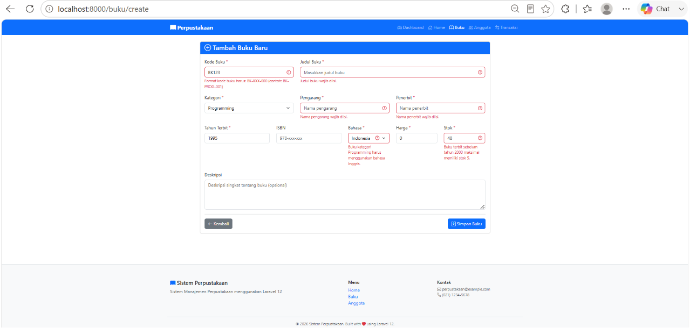
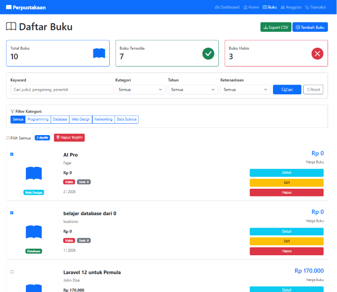
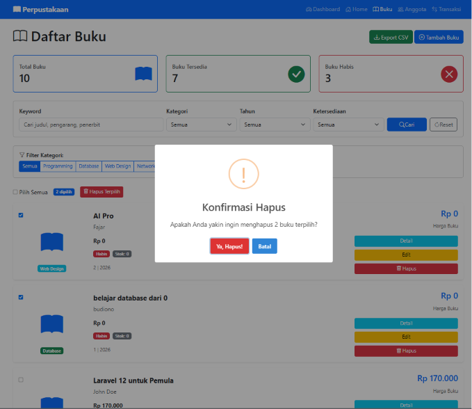
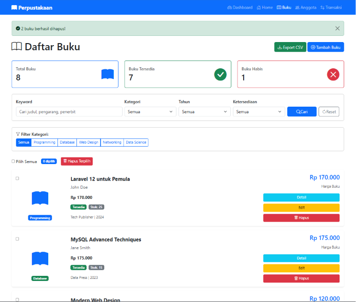
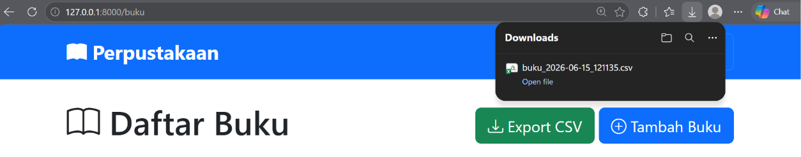
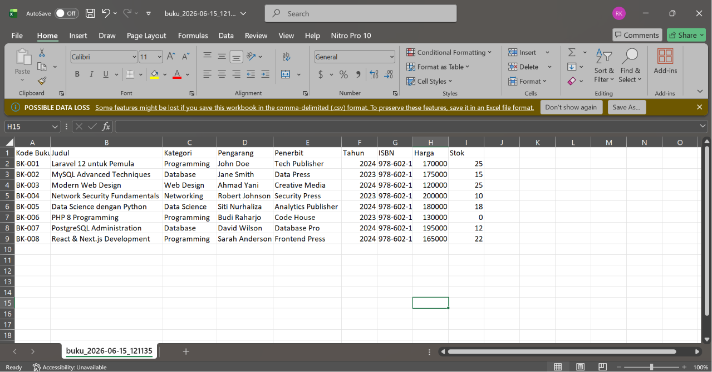

# 60324019_Rachel-Karima-Abdullah_Tugas-Pertemuan12

## Praktikum Pertemuan 10
Implementasi Migration, Seeder, Accessor, dan Scope pada Laravel.

## Screenshot Hasil

### Migration

### Seeder

### Route Testing

## 1. Validation Rules Advanced

## 2. Bulk Delete Operations

## 3. Export Buku ke CSV

